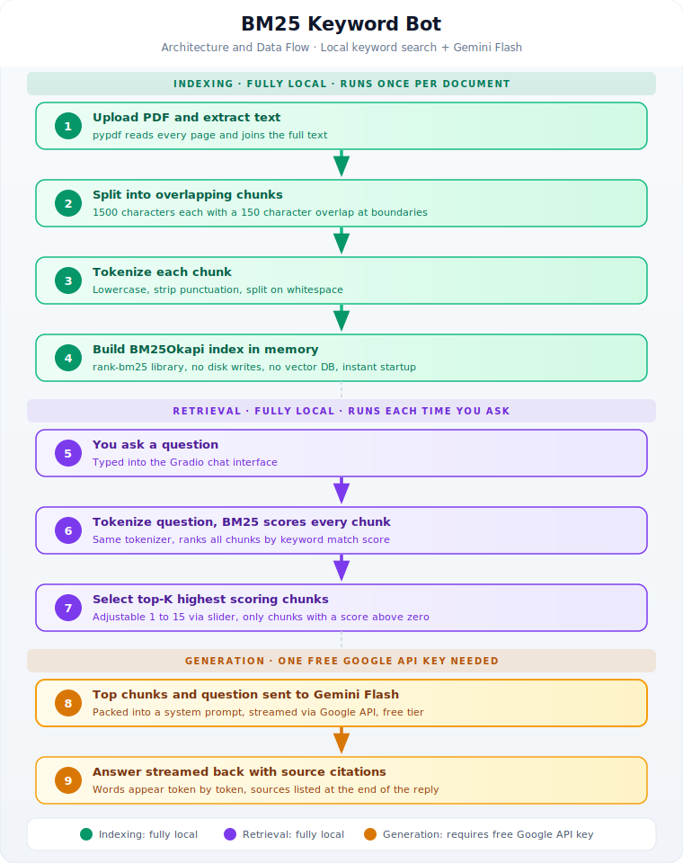

# BM25 Keyword Bot

Ask questions about any PDF using keyword search. Fast, local, and lightweight. The search runs entirely on your computer with no embeddings and no vector database. You only need one free API key for the final answer.

---

## What does this do?

You upload a PDF. The app reads it, chops it into small pieces (called chunks), and builds a keyword index from those pieces. When you ask a question, it scans the index for chunks that contain your keywords, picks the best ones, and passes them to Gemini Flash. Gemini reads those chunks and writes a clean answer.

Two things to be clear about what happens locally and what does not:

| Step | Where it runs |
|---|---|
| Reading the PDF | Your computer |
| Splitting into chunks | Your computer |
| Keyword indexing (BM25) | Your computer, in memory |
| Searching for relevant chunks | Your computer |
| Writing the final answer | Gemini Flash via Google API |

The search and retrieval part is fully local. You do need a free Google API key for Gemini to generate the answer. That is the only external service this project uses.

---

## Why does this matter?

Most RAG systems need two APIs: one to create embeddings (turning text into numbers), and one to generate the answer. This project skips the embeddings step entirely by using BM25 keyword matching instead. That makes setup simpler, startup instant, and running costs lower.

You still need Gemini for the final answer. But you do not need any embeddings API, vector database, or model running locally.

---

## How it works, step by step



```
1. You upload a PDF
        |
        v
2. The app reads all the text from every page
        |
        v
3. The text is cut into overlapping chunks (1500 characters each)
        |
        v
4. Every chunk is split into lowercase words (punctuation removed)
        |
        v
5. A BM25 index is built from all those word lists (stored in memory)
        |
        v
6. You type a question
        |
        v
7. Your question is also split into words
        |
        v
8. BM25 scores every chunk by how well it matches your words
        |
        v
9. The top-K highest scoring chunks are picked
        |
        v
10. Those chunks + your question are sent to Gemini Flash (API call)
        |
        v
11. Gemini writes the answer and streams it back to you
```

---

## What is BM25?

BM25 is a scoring algorithm used by search engines like Elasticsearch and early Google. It works like a librarian who counts how many times your search words appear in each document, gives extra points for rare words, and penalises documents that are unusually long.

It does not understand meaning. It counts words.

That means it works great when you search with exact terms that appear in the document (product codes, names, technical terms). It struggles when you rephrase something or use synonyms the document did not use.

---

## Tech stack

| Part | Tool | Runs where |
|---|---|---|
| PDF reading | pypdf | Local |
| Keyword search | rank-bm25 (BM25Okapi) | Local |
| Index storage | Plain Python list in memory | Local |
| Answer generation | Google Gemini Flash (free tier) | Google API |
| UI | Gradio | Local |

---

## What you need before starting

- Python 3.11 or newer
- A free Google API key (for Gemini Flash)
- Internet connection (only for the Gemini answer step)

No GPU. No paid API. No vector database to install.

---

## Setup

**Step 1. Get a free Gemini API key**

Go to [aistudio.google.com/apikey](https://aistudio.google.com/apikey) and create a key. No billing required.

**Step 2. Create a virtual environment and install dependencies**

```bash
cd rag/bm25-qa-bot
python -m venv venv

# On Mac or Linux:
source venv/bin/activate

# On Windows:
venv\Scripts\activate

pip install -r requirements.txt
```

**Step 3. Add your API key**

```bash
cp .env.example .env
```

Open the `.env` file and set your key:

```
GOOGLE_API_KEY=your_key_here
```

**Step 4. Run the app**

```bash
python main.py
```

Open your browser at `http://localhost:7866`

---

## How to use it

1. Click **Upload PDF** and pick a file
2. Click **Index Document** and wait for the confirmation message
3. Type your question in the chat box and press **Send** or hit Enter
4. Read the answer. Sources are listed at the bottom of every reply
5. Click **Clear Index** to remove everything and start fresh with a new file
6. Use the **Top-K** slider to control how many chunks are sent to Gemini (more chunks = more context but slower)

You can upload multiple PDFs. Each one adds its chunks to the same index.

---

## Tips for better results

- Use words that are actually in the PDF. BM25 matches keywords exactly.
- If you get no results, try rephrasing with more specific terms from the document.
- Increase Top-K if the answer feels incomplete.
- Decrease Top-K if the answer feels unfocused or off-topic.

---

## Project structure

```
bm25-qa-bot/
|-- main.py           Full app: ingestion, BM25 index, retrieval, Gradio UI
|-- requirements.txt  Python dependencies
|-- .env.example      Template for your API key
|-- .env              Your actual API key (not committed to git)
```

---

## BM25 vs vector search: which one to use

| Situation | Best choice |
|---|---|
| Searching for exact names, codes, or technical terms | BM25 (this project) |
| Asking questions in natural language with synonyms | Vector search (document-qa-bot) |
| Want instant startup with no model download | BM25 (this project) |
| Need the index to survive app restarts | Vector search (document-qa-bot) |
| Learning how RAG works with minimum moving parts | BM25 (this project) |
| Need to find things even when you rephrase the question | Vector search (document-qa-bot) |
